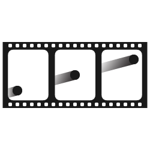

<p align="center">
  
</p>

<h1 align="center">DeltaFrame</h1>

<p align="center">DeltaFrame is a lightweight animation and game loop manager. <p>

<div align="center">
  <a href="https://badge.fury.io/js/deltaframe"></a>
  <a href="https://badge.fury.io/js/deltaframe"></a>
  <a href="https://badge.fury.io/js/deltaframe"></a>
  <a href="https://badge.fury.io/js/deltaframe"></a>
</div>

## **Installation**

To install this module through npm, simply use the following command:

```
$ npm install deltaframe
```

and to use it, you can import it as an ES6 module:

```js
import Deltaframe from './node_modules/deltaframe/deltaframe.js';
```

## **Initialization**

After installing Deltaframe, it can be initialized like so:

```js
const deltaframe = new Deltaframe();
```

Deltaframe also accepts an options object at initialization with the following options available:

| param              | type    | description                                                                                                                              | default  |
|--------------------|---------|------------------------------------------------------------------------------------------------------------------------------------------|----------|
| minFps             | number  | The minimum number of frames per second to run deltaframe at. If frames per second drop below this, deltaframe will attempt to restart.  | 5        |
| targetFps          | number  | The number of frames per second that deltaframe should achieve.                                                                          | 60       |
| maxRestartAttempts | number  | The number of times deltaframe will attempt to restart before stopping entirely.                                                         | Infinity |
| runTime            | number  | Specify a value in milliseconds to have Deltaframe automatically stop after the specified amount of time has passed.                     | Infinity |
| forceSetTimeout    | boolean | Indicates whether setTimeout should be used instead of requestAnimationFrame even if requestAnimation is supported by the user's browser | false    |

So an example of initializating Deltaframe with options is:

```js
const options = {
  minFps: 40,
  maxRestartAttempts: 10
};

const deltaframe = new Deltaframe(options);
```

From here you can use any of the conversion features available.

## **API**

Deltaframe all revolves around a function you pass to it and this function should contain your drawing code.

For example, we'll take a simple game loop that moves a circle.

Traditionally, with `requestAnimationFrame` it would be accomplished like so:

```js
const canvas = document.getElementById('myCanvas');
const ctx = canvas.getContext('2d');

let x = canvas.width / 2;
let y = canvas.height - 30;

function drawCircle() {

  ctx.beginPath();
  ctx.arc(x, y - 30, 10, 0, Math.PI * 2);
  ctx.fillStyle = '#0095DD';
  ctx.fill();
  ctx.closePath();

}

function draw(time) {

  ctx.clearRect(0, 0, canvas.width, canvas.height);
  
  drawCircle();

  x += 2;
  y += -2;

  requestAnimationFrame(draw);

}

requestAnimationFrame(draw);
```

This example uses `drawCircle` to just draw a circle centered horizontally and near the bottom of the canvas
and then it uses `requestAnimationFrame` recursively to keep the loop going and it makes the ball go diagonally.

To change this so that it uses deltaframe instead, use the following:

```js
const canvas = document.getElementById('myCanvas');
const ctx = canvas.getContext('2d');

let x = canvas.width / 2;
let y = canvas.height - 30;

function drawCircle() {

  ctx.beginPath();
  ctx.arc(x, y - 30, 10, 0, Math.PI * 2);
  ctx.fillStyle = '#0095DD';
  ctx.fill();
  ctx.closePath();

}

function draw(time, delta, deltaAverage) {

  ctx.clearRect(0, 0, canvas.width, canvas.height);
  
  drawCircle();

  x += 2;
  y += -2;

}

deltaframe.start(draw);
```

The biggest difference here is removing all calls to `requestAnimationFrame` and just using `deltaframe.start(draw)` instead. You'll also notice now that the draw function now accepts two more parameters because deltaframe returns three values which can be used inside of your drawing function. The `time` parameter is the same as it is in the first example, its the DOMHighResTimestamp as returned from `requestAnimationFrame` or (`window.performance.now()` in the case of `setTimeout`). The `delta` parameter is the change in time from the last frame to this frame and `deltaAverage` is the mean of the most recent 10 delta values. These values can all be used inside of the `draw` function however you deem fit.

### **start**

The start method takes a function and begins running the deltaframe loop on it.

| param | type     | description                             | default |
|-------|----------|-----------------------------------------|---------|
| fn    | Function | The function to call on a drawing loop. |         |

```js
const canvas = document.getElementById('myCanvas');
const ctx = canvas.getContext('2d');

let x = canvas.width / 2;
let y = canvas.height - 30;

function drawCircle() {

  ctx.beginPath();
  ctx.arc(x, y - 30, 10, 0, Math.PI * 2);
  ctx.fillStyle = '#0095DD';
  ctx.fill();
  ctx.closePath();

}

function draw(time, delta, deltaAverage) {

  ctx.clearRect(0, 0, canvas.width, canvas.height);
  
  drawCircle();

  x += 2;
  y += -2;

}

deltaframe.start(draw);
```

### **pause**

The pause method temprarily stops the deltaframe loop. This should only be used if you plan on resuming it at some point and not just stopping entirely.

Note that deltaframe automatically pauses when the user switches tabs.

```js
// Start the drawing loop.
deltaframe.start(draw);

setTimeout(() => {

  // After one second the drawing loop will pause and the game will look 'frozen'.
  deltaframe.pause();

}, 1000);
```

### **resume**

The resume method resumes the deltaframe loop after a paused state. Everything will be where it was before it was paused so it will seem like it was never
even paused.

Note that deltaframe automatically resumes from being paused when the user switches back to the tab containing deltaframe.

```js
// Start the drawing loop.
deltaframe.start(draw);

setTimeout(() => {

  // After one second the drawing loop will pause and the game will look 'frozen'.
  deltaframe.pause();

  setTimeout(() => {

    // After two seconds resume the drawing loop like it was never even paused.
    deltaframe.resume();

  }, 2000);

}, 1000);
```

### **stop**

The stop method stops the game and resets all deltaframe values back to their original values.

Note that this should only be used when you are done with the animation or drawing. In order to start the loop again you have to call start and provide the
drawing function.

```js
// Start the drawing loop.
deltaframe.start(draw);

// If some imaginary condition is met, stop deltaframe from running any more.
if (someConditionThatEndsTheAnimation) {

  deltaframe.stop();

}
```

## **License**

MIT